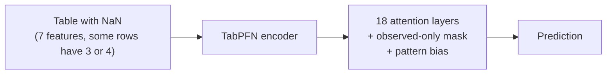

# TabPFN-M

**TabPFN for tables where some rows have fewer features than others.**

Many real datasets are merged from several sources. One lab measured 7 soil
properties, another only 3 of them, a third 4. TabPFN-M is a small extension of
the pretrained [TabPFN](https://github.com/PriorLabs/TabPFN) model built for
exactly this case. You give it a table with `NaN` where a value was not
measured, and it predicts the target.

It adds three optional parts to TabPFN, all switchable, so it can also run as
plain TabPFN:

1. **Observed-only attention.** Each row looks only at the features it has.
2. **Pattern bias.** A test row pays more attention to training rows that were
   measured the same way.
3. **Fine-tuning for block missingness.** Train on your own data with realistic
   "this lab did not measure that" masking and a reconstruction task.



## Install

Python 3.10 or newer. CPU is enough.

```bash
git clone https://github.com/Sompote/TabPFN-M
cd TabPFN-M
pip install -e .
```

The first run downloads the TabPFN weights (about 40 MB).

## Use

```python
import numpy as np
from tabpfn_m import TabPFNMRegressor

# X_train, X_test: numpy arrays with np.nan where a feature was not measured
model = TabPFNMRegressor(device="cpu")
model.fit(X_train, y_train)
pred = model.predict(X_test)
```

For classification use `TabPFNMClassifier` the same way.

Switch parts on or off with `TabPFNMConfig`:

```python
from tabpfn_m import TabPFNMRegressor, TabPFNMConfig

cfg = TabPFNMConfig(
    feature_mask=True,      # observed-only attention
    pattern_bias=True,      # attention bias by measurement pattern
    alpha_init=1.0,         # strength of the bias (0 = off)
    learn_alpha=False,      # fixed value, no training
)
model = TabPFNMRegressor(device="cpu", m_config=cfg)
```

`TabPFNMConfig.baseline()` gives plain TabPFN.

Fine-tune on your own data and reuse the weights:

```python
from tabpfn_m.finetune import FinetunedTabPFNMRegressor

ft = FinetunedTabPFNMRegressor(device="cpu", epochs=30)
ft.fit(X_train, y_train)
ft.m_save("tabpfn_m.pt")

model = TabPFNMRegressor(device="cpu", m_weights="tabpfn_m.pt")
```

## What we found so far

Plain TabPFN already handles missing values well. It marks each missing cell
with an indicator, and the attention learns to use it. In our tests the extra
parts of TabPFN-M changed accuracy by less than 0.01 R², up or down, both
without training and after fine-tuning. Details and tables are in
[docs/RESULTS.md](docs/RESULTS.md).

Practical advice: put `NaN` where a value is missing and use the model as is.
The accuracy you lose comes from the missing information itself, not from the
model.

## Scripts

| script | what it does |
|---|---|
| `scripts/benchmark_missing.py` | TabPFN vs TabPFN-M vs gradient boosting under random and block missingness |
| `scripts/compaction_loso.py` | same on a real 6-source soil compaction database, leave-one-source-out |
| `scripts/finetune_demo.py` | fine-tune on one dataset and compare |
| `scripts/meta_finetune.py` | train the new parts across many synthetic tasks |

Tests: `python -m pytest tests -q`

## More

- [docs/ARCHITECTURE.md](docs/ARCHITECTURE.md): how the model works inside,
  tensor shapes, and how to change each part.
- [docs/RESULTS.md](docs/RESULTS.md): all experiment tables.
- Built on `tabpfn` 6.4.1. The v2.5 default weights need a free Hugging Face
  account that accepted the TabPFN license; without one the v2 weights are used.

## Credit and prior work

TabPFN is by Prior Labs (Hollmann et al., 2025). The observed-only attention
follows NAIM (Caruso et al., 2024); the reconstruction task follows ReMasker
and VIME. The pattern bias is new to our knowledge.
