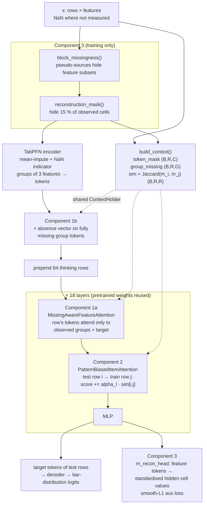

# TabPFN-M: TabPFN for tables with incomplete feature sets

TabPFN-M adapts a pretrained TabPFN v2 checkpoint to data where different rows
carry different feature subsets. The target case is a merged database: seven
features in the schema, but one laboratory reports three of them and another
four. Missingness is then block-structured by source, not random per cell.

Plain TabPFN handles NaN by mean-imputing the cell and appending a NaN indicator
to the token. TabPFN-M keeps that encoder and changes how attention treats the
missing tokens. All changes are additive, so with every switch off the model
equals the pretrained TabPFN bit for bit (tested).

Repository: `tabpfn_m/` (package), `scripts/` (benchmarks and training),
`tests/` (14 tests), `data/compaction.csv` (2,854 compaction records from 6
public sources), `results/` (all runs so far). The `tabpfn/` folder is an
upstream clone kept for reference only.

## Architecture

TabPFN represents a table as a grid of tokens: one token per (row, feature
group) plus one target token per row. Each layer runs attention along both
axes. TabPFN-M inserts three things into that grid without changing the
pretrained weights.



### Where each component lives

| component | file | class / function | trainable params |
|---|---|---|---|
| context (masks, Jaccard) | `tabpfn_m/context.py` | `build_context`, `ContextHolder` | none |
| 1a observed-only feature attention | `tabpfn_m/attention.py` | `MissingAwareFeatureAttention` | none (wraps pretrained q/k/v/out) |
| 1b absence vector | `tabpfn_m/model.py` | `m_absence_embedding` | 192 |
| 2 pattern-overlap bias | `tabpfn_m/attention.py` | `PatternBiasedItemAttention` | 1 scalar `alpha` per layer (18) |
| 3 augmentation + reconstruction | `tabpfn_m/augment.py`, `tabpfn_m/model.py` | `block_missingness`, `reconstruction_mask`, `m_recon_head` | 192 × 3 + 3 |
| forward pass | `tabpfn_m/model.py` | `TabPFNMTransformer.forward`, `_forward_body` | |
| upgrade of a loaded model | `tabpfn_m/model.py` | `upgrade_model(model, cfg)` | |
| sklearn estimators | `tabpfn_m/estimator.py` | `TabPFNMRegressor`, `TabPFNMClassifier` | |
| fine-tuning | `tabpfn_m/finetune.py` | `FinetunedTabPFNMRegressor`, `_param_group_optimizer` | |
| switches | `tabpfn_m/config.py` | `TabPFNMConfig`, `AugmentConfig` | |

### Tensor shapes

Notation: B datasets in the batch, S data rows, T = 64 thinking rows,
R = T + S, F raw features, n = 3 features per group, G = ceil(F / n) groups,
C = G + 1 tokens per row (the last is the target), E = 192 embedding size.

- model input `x`: (S, B, F) with NaN; `y`: (S_train, B)
- `token_mask_BRC`: bool (B, R, C). False where a row's feature group has no
  observed feature. Thinking rows and the target column are always True.
- `group_missing_BRG`: bool (B, R, G). Where the absence vector is added.
- `sim_BRR`: float (B, R, R). Jaccard overlap of observed-feature sets. Rows
  are 1 on the diagonal; thinking-row keys get the query's mean overlap with
  the training rows, thinking-row queries see 1 everywhere. With complete data
  the matrix is all ones, so the bias is a constant and the softmax is
  unchanged.
- feature attention input: (B·R, C, E); mask broadcast as (B·R, 1, 1, C)
- item attention input: (B·C, R_q, E) queries, (B·C, R_k, E) keys; bias
  (B·C, 1, R_q, R_k) = `alpha_l · sim[q0:q0+R_q, k0:k0+R_k]`
- recon head: feature tokens (B, S, G, E) → (B, S, G, n) → reshaped to
  (S, B, G·n)[..., :F]; loss only on the hidden cells

### How the pieces are wired

1. `upgrade_model` swaps the class of a loaded `PerFeatureTransformer` to
   `TabPFNMTransformer` (weights untouched), wraps every layer's two attention
   modules with the two wrapper classes, and registers the new parameters.
   All wrappers hold a reference to one `ContextHolder`.
2. `TabPFNMTransformer.forward` (a compact re-implementation of the upstream
   forward) applies the training-time augmentation, calls `build_context` on
   the raw NaN input, puts the context into the holder, adds the absence
   vector after the encoder, runs the pretrained layer stack, and computes the
   reconstruction loss from the final feature tokens. The context is left in
   the holder after the forward because activation checkpointing recomputes
   layers during backward.
3. Each wrapper checks `holder.ctx`. If it is `None`, or its switch is off, it
   delegates to the wrapped pretrained module unchanged. Otherwise it projects
   q, k, v with the pretrained weights (`inner.compute_qkv`) and runs
   `torch.nn.functional.scaled_dot_product_attention` with the mask or bias.
4. Training behaviour (augmentation, reconstruction) is gated on
   `model.m_training and torch.is_grad_enabled()`, because tabpfn never calls
   `train()`/`eval()` and predicts under inference mode.

## How to modify

**Change what counts as "missing" for the feature mask.** Edit
`group_missing_BSG` in `context.py::build_context`. Now a group is masked only
when all its features are missing. To mask groups with any missing feature,
replace `(~group_obs_any_BSG)` with `(~obs_BSGn.all(-1))`. To mask at the cell
level instead, set `features_per_group=1` in the checkpoint config; this
changes the encoder input width and needs retraining of the encoder.

**Change the similarity used by the bias.** Replace `jaccard_similarity` in
`context.py`. Any (B, S, S) matrix works. Keep the thinking-row convention (mean
overlap for keys, 1 for queries) or the complete-data equivalence test
`test_complete_data_matches_pretrained_with_components_on` will fail.

**Apply the bias to train-train attention too.** Set
`TabPFNMConfig(bias_test_only=False)`. The zero-shot sweep showed this hurts;
it changes the in-context representation the pretrained layers rely on.

**Use a per-head or per-layer-vector alpha.** In
`attention.py::PatternBiasedItemAttention.__init__` change `alpha` to shape
(num_heads,) and in `_bias` reshape it to (1, H, 1, 1) before multiplying.
`m_new_parameters()` and `m_alphas()` in `model.py` read `a.alpha`; adapt
`m_alphas` to report a mean.

**Change the augmentation prior.** `AugmentConfig` controls the number of
pseudo-sources, the kept fraction and the MCAR rate. For MNAR, add a rule to
`augment.py::block_missingness` that hides cells based on their value, for
example `hide |= x > quantile`. For source-dependent target shifts you have to
change the task sampler in `scripts/meta_finetune.py::sample_task`, not the
augmenter, because the augmenter only sees x.

**Change the reconstruction target or loss.** `augment.py::standardise_targets`
produces z-scores of the raw values from train-row statistics; the loss is
smooth-L1 in `model.py::_forward_body`. To reconstruct in the encoder's
normalised space, read the features after `self.encoder` instead.

**Add a fourth component.** Put its state into `MissingnessContext`, compute it
in `build_context`, read it through the holder in a new wrapper or in
`_forward_body`, add a switch to `TabPFNMConfig`, and add a test that the
all-off configuration still matches the pretrained model exactly
(`test_all_off_matches_pretrained`).

**Run an ablation.** Every switch is a field of `TabPFNMConfig`. Both benchmark
scripts build their method list from configs in one dictionary
(`benchmark_missing.py::run_method`, `compaction_loso.py::fit_predict`); add a
name and a config there.

**Fine-tune on your own data.** `FinetunedTabPFNMRegressor` takes the tabpfn
fine-tuner arguments plus `m_config`, `m_freeze_base` and `m_new_param_lr`.
Use `m_freeze_base=True` to learn only the new parameters. Save with
`.m_save(path)` and load with `TabPFNMRegressor(m_weights=path)`.

**Use a different checkpoint.** Anything tabpfn 6.4.1 loads as a
`PerFeatureTransformer` works, including v2 and v2.5 files. Pass `model_path`
to the estimator. Take the model from the estimator, not from
`load_model_criterion_config(version="v2")`, which loads a different file (6
heads) than the estimator default (3 heads).

## Prior art to cite as such

- TabPFN v2 (Hollmann et al., 2025): cell-wise missingness in the prior and
  the NaN indicator. This is the baseline, not a contribution.
- NAIM (Caruso et al., 2024): attention masks over missing features in a
  transformer trained per dataset. Component 1 brings the idea to in-context
  learning with a pretrained checkpoint.
- ReMasker / VIME: masked reconstruction as a self-supervised objective for
  tabular data. Component 3 uses it as an auxiliary loss during fine-tuning.
- The pattern-overlap bias (component 2) is, to my knowledge, new. Check the
  literature before claiming it.

## Limits of the implementation

- Runs on the installed `tabpfn` 6.4.1 (TabPFN v2 architecture, open weights).
  The `tabpfn/` folder is an upstream clone; it needs torch 2.5+, which has no
  wheels for Intel macOS.
- No KV cache and no `save_peak_mem_factor` chunking inside the wrapped
  attention. Fine for datasets up to a few thousand rows on CPU. The item
  attention bias materialises a (B·C, R_q, R_k) tensor per layer.
- Regressor and classifier estimators exist; the classifier is only smoke
  tested.

## Use

```python
from tabpfn_m import TabPFNMRegressor, TabPFNMConfig

# zero-shot: observed-only attention + pattern bias with a fixed alpha
est = TabPFNMRegressor(device="cpu", m_config=TabPFNMConfig(alpha_init=1.0, learn_alpha=False))
est.fit(X_train_with_nans, y_train)
pred = est.predict(X_test_with_nans)

# fine-tune on your own data, then reuse the weights
from tabpfn_m.finetune import FinetunedTabPFNMRegressor
ft = FinetunedTabPFNMRegressor(device="cpu", epochs=30, learning_rate=1e-5, m_new_param_lr=1e-2)
ft.fit(X_train_with_nans, y_train)
ft.m_save("tabpfn_m.pt")
est = TabPFNMRegressor(device="cpu", m_weights="tabpfn_m.pt")
```

Tests: `python -m pytest tests -q`. Benchmarks: `python scripts/benchmark_missing.py`,
`python scripts/compaction_loso.py`. Fine-tuning: `python scripts/finetune_demo.py`,
`python scripts/meta_finetune.py`. A GitHub Actions workflow
(`.github/workflows/experiments.yml`) runs any of these on a Linux runner.

## Results so far (6 Sep 2026, TabPFN v2.5 default checkpoint, CPU)

Zero-shot, no training (`results/zero_shot`, 3 seeds, 4 ensemble members,
R² mean over seeds):

| dataset / design | HGB | TabPFN mean-impute | TabPFN | M mask | M mask+bias(1) |
|---|---|---|---|---|---|
| friedman1 / block 3-4 of 7 | 0.305 | 0.408 | 0.412 | 0.412 | 0.408 |
| friedman1 / mcar50 | 0.402 | 0.456 | 0.497 | 0.497 | 0.494 |
| compaction MDD / block 3-4 of 7 | 0.481 | 0.534 | 0.537 | 0.537 | 0.532 |
| compaction MDD / mcar50 | 0.455 | 0.499 | 0.533 | 0.532 | 0.529 |
| diabetes / block 3-4 of 7 | 0.074 | 0.239 | 0.237 | 0.238 | 0.230 |

Mean R² difference to TabPFN over all 15 cells: 0.000 (mask), -0.003 (mask +
bias). Untrained, the components are inert. TabPFN's NaN indicator already
carries the pattern information: with a source-dependent target offset the
pattern reveals the source, and TabPFN on block-missing data reaches R² 0.83
where the same model on complete data (source invisible) reaches 0.17.

Single-dataset fine-tuning (`results/finetune_friedman*`, 500 rows, 30 epochs)
moves the per-layer alphas by at most 0.1 and changes R² by less than 0.01
against a plain fine-tuned TabPFN control. The new parameters are prior-level
and need meta-fine-tuning across many tasks (`scripts/meta_finetune.py`).

Meta-fine-tuning across random synthetic block-missing tasks
(`results/meta_ft*`, 300 steps, 4 tasks of 300 rows per step, held-out Friedman
block task, 2 seeds):

| step | full fine-tune (base LR 1e-5, new LR 5e-3) | frozen base (new params only) |
|---|---|---|
| 0 | 0.349 | 0.349 |
| 100 | 0.340 | 0.348 |
| 200 | 0.335 | 0.348 |
| 300 | 0.335 | 0.348 |

The learned alphas settle in a stable pattern (about -0.2 in layers 7 to 10,
+0.3 in layer 16) that is the same in both runs, so the gradient signal is
consistent, but the held-out score does not move. Updating the pretrained
weights on my synthetic prior costs 0.014 R². Conclusion at this stage: on top
of TabPFN v2.5, whose NaN indicator already encodes the pattern, the three
components give no measurable gain in this setting. A different data regime
(real multi-source data with source effects, MNAR) or a richer prior for
meta-fine-tuning is needed before any claim can be made.

## Evaluation plan

Ablate the three components separately (the config switches exist for this),
on synthetic block missingness and on the compaction database with
leave-one-source-out folds, against TabPFN with NaN, TabPFN with mean
imputation, and HistGradientBoosting. Results live in `results/`.
